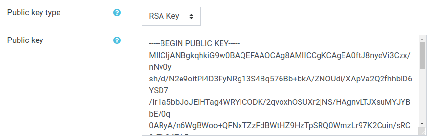
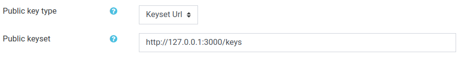

# basiclti4moodle
Moodle's basiclti4moodle, with changes to allow the usage of JWK keysets. A pull request will be sent to moodle with these changes.

## Installation

- Replace the `/mod/lti` folder of your current moodle installation with the `lti` folder from this repo.

## Features

- Added support for JWK keysets, which makes it way easier to use LTI 1.3 tools with moodle, and improves security by allowing key rotation.

- Added items to the LTI tool configuration menu to select the type of authentication to be used (RSA key or JWK keyset).

#### RSA Key

#### JWK keyset

